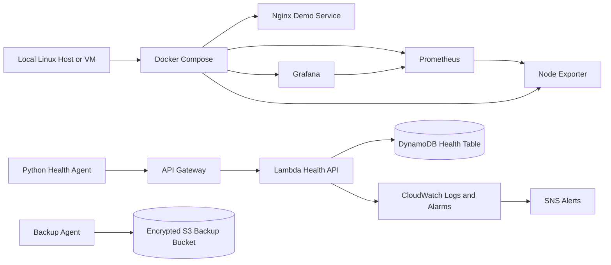

# Terraform-Managed Hybrid Infrastructure Lab

A portfolio infrastructure lab that connects a local Docker monitoring stack with AWS serverless services managed by Terraform.

This repository is currently in its **Phase 1 foundation** state: project structure, documentation, safety guardrails, and implementation roadmap. The goal is to build the lab incrementally, with each milestone committed only after validation.

## Project Purpose

This lab is designed to demonstrate practical cloud and infrastructure skills:

- local service orchestration with Docker Compose
- infrastructure monitoring with Prometheus and Grafana
- Python automation agents for health reporting and backups
- AWS serverless ingestion using API Gateway, Lambda, DynamoDB, S3, CloudWatch, SNS, and IAM
- Terraform-managed infrastructure as code
- GitHub Actions validation
- security-aware documentation and teardown procedures

The finished project will show how local infrastructure can report telemetry to cloud services while keeping credentials, Terraform state, and environment-specific configuration out of version control.

## Planned Architecture



## Technology Stack

| Area | Planned tools |
| --- | --- |
| Local infrastructure | Docker Compose, Nginx, Prometheus, Grafana, Node Exporter |
| Automation | Python, pytest, structured logging |
| Cloud | AWS API Gateway, Lambda, DynamoDB, S3, CloudWatch, SNS, IAM |
| Infrastructure as code | Terraform |
| CI | GitHub Actions |
| Documentation | Markdown, Mermaid diagrams |

## Repository Structure

```text
.
├── agents/
│   ├── backup-agent/
│   └── health-agent/
├── backend/
│   └── health-api/
├── docs/
│   ├── portfolio/
│   ├── runbooks/
│   └── superpowers/
├── infrastructure/
│   └── terraform/
│       ├── environments/
│       │   └── dev/
│       └── modules/
├── local-infrastructure/
│   ├── grafana/
│   ├── nginx/
│   ├── prometheus/
│   └── scripts/
├── tests/
├── .github/workflows/
├── .env.example
├── .gitignore
├── Makefile
└── README.md
```

## Current Status

- [x] Repository structure created
- [x] Public-safe documentation scaffolded
- [x] Secret and generated-file exclusions added
- [x] Initial development commands documented
- [ ] Local Docker monitoring stack implemented
- [ ] Grafana dashboards provisioned
- [ ] Python health agent implemented
- [ ] Terraform AWS foundation implemented
- [ ] Lambda health ingestion API implemented
- [ ] Backup agent implemented
- [ ] CloudWatch alarms and outage detection implemented
- [ ] Full CI validation implemented
- [ ] Portfolio screenshots captured

## Development Phases

1. Initialize the repository and documentation foundation.
2. Build the local Docker monitoring stack.
3. Provision Grafana dashboards automatically.
4. Build the local Python health agent.
5. Provision the AWS foundation with Terraform.
6. Build and deploy the Lambda health API.
7. Connect the local health agent to AWS.
8. Containerize the health agent.
9. Build the encrypted backup agent.
10. Add outage detection and alerting.
11. Add GitHub Actions CI.
12. Harden security and prepare portfolio documentation.

See [docs/ROADMAP.md](docs/ROADMAP.md) for the detailed implementation roadmap.

## Local Setup

Install the expected tools before implementing later phases:

```bash
git --version
docker --version
docker compose version
python3 --version
terraform version
aws --version
```

Copy the example environment file before running local services:

```bash
cp .env.example .env
```

Do not commit `.env`, AWS credentials, Terraform state, private keys, or generated archives.

## Makefile Commands

```bash
make help
make repo-check
make tree
make security-check
```

Implementation-phase commands are present as placeholders and will be replaced with working commands as each subsystem is added.

## Security Principles

- No credentials in source control.
- No Terraform state in source control.
- AWS resource names, regions, and alert destinations should be configurable.
- IAM policies should be least-privilege and scoped to the resources they need.
- Public S3 access must remain blocked.
- Docker socket access should be avoided unless a documented feature requires it.
- Logs should avoid secrets, tokens, private URLs, and sensitive headers.

## Cost Control

The planned AWS resources are intentionally small and portfolio-focused. The Terraform documentation will include teardown steps before any resources are deployed.

## Screenshots

Screenshots will be added after the implementation phases produce running services:

- Docker Compose services
- Nginx status page
- Prometheus targets
- Grafana dashboard
- Health agent output
- DynamoDB health records
- S3 backup objects
- CloudWatch logs and alarms
- GitHub Actions passing checks

Sensitive account identifiers, credentials, private URLs, and personal data must be redacted before screenshots are committed.

## License

This project is intended for personal portfolio and learning use. Add a license before accepting external contributions.
