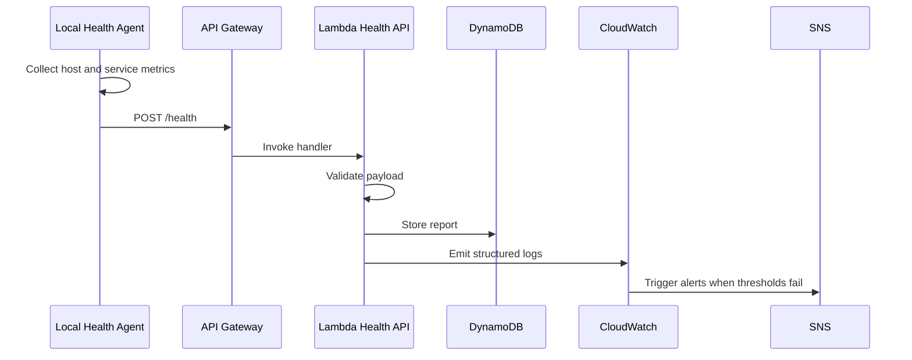
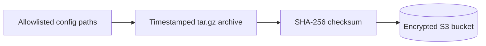

# Architecture

The final lab will connect local infrastructure telemetry to AWS-managed storage, logging, alerting, and backups.

## Local Layer

The local layer is planned as a Docker Compose stack:

- Nginx serves a small status page.
- Prometheus collects local metrics.
- Grafana visualizes metrics from Prometheus.
- Node Exporter exposes host metrics where supported.
- The health agent collects system and service state.
- The backup agent archives approved configuration files.

## Cloud Layer

The AWS layer will be provisioned with Terraform:

- API Gateway exposes a `POST /health` endpoint.
- Lambda validates telemetry payloads.
- DynamoDB stores health reports.
- S3 stores encrypted configuration backups.
- CloudWatch stores logs and powers alarms.
- SNS sends outage and recovery notifications.
- IAM roles and policies keep permissions scoped.

## Telemetry Flow

## Backup Flow

## Design Boundaries

- Local code should run without AWS until cloud integration is explicitly enabled.
- Terraform should not depend on local Docker state.
- Python agents should read configuration from environment variables.
- Cloud resources should be small, configurable, and easy to destroy.
- Documentation should distinguish implemented behavior from planned behavior.
